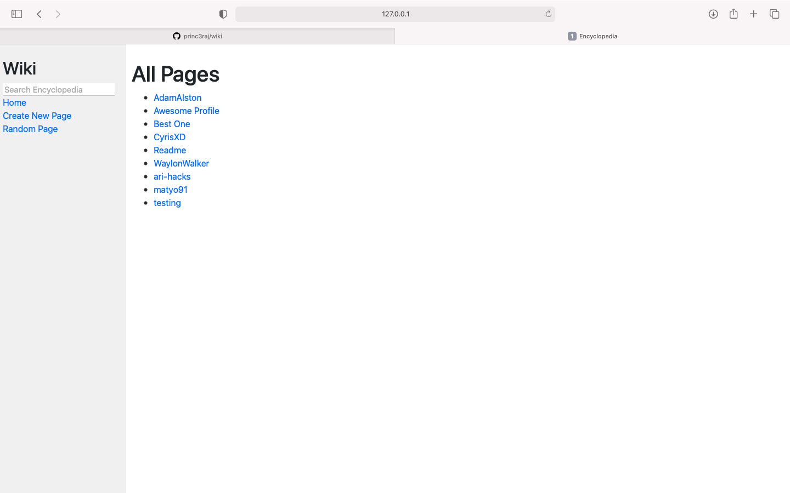
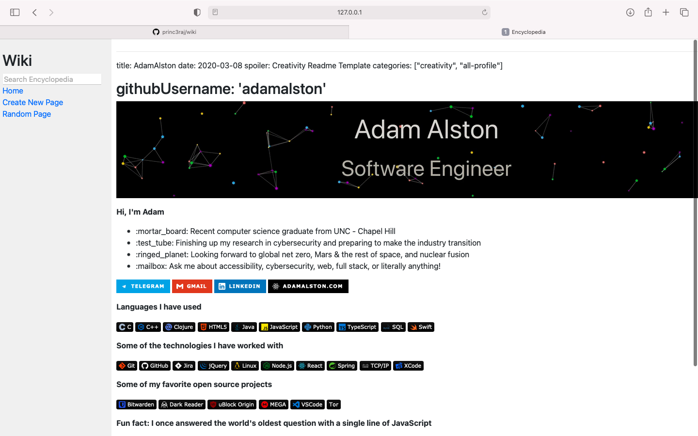
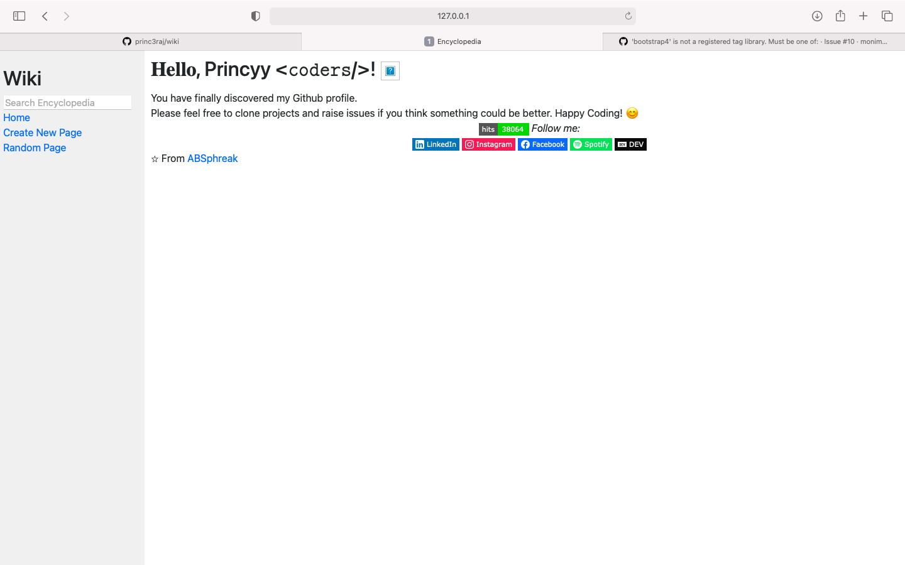
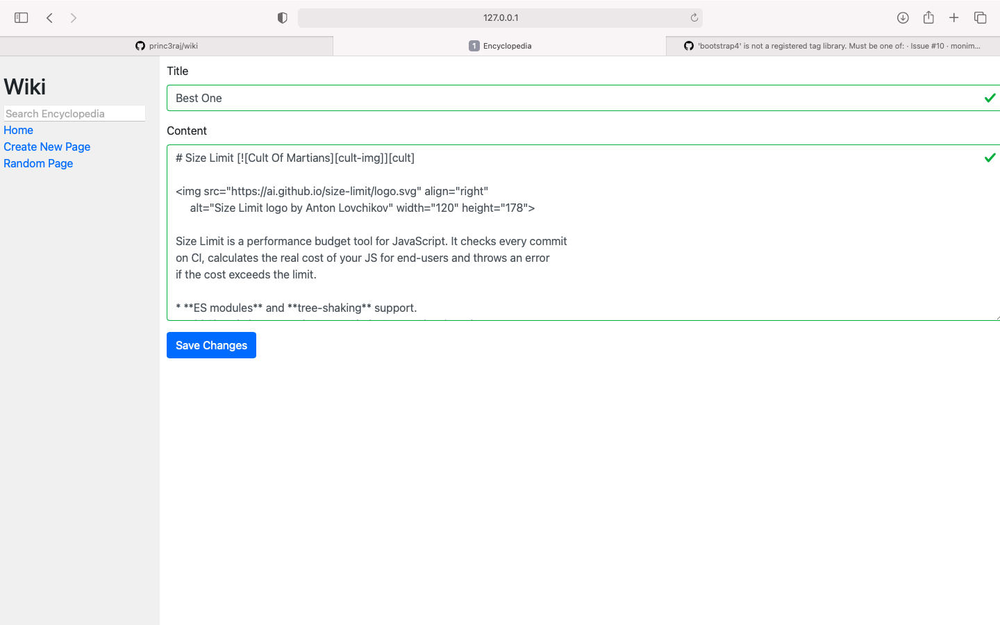
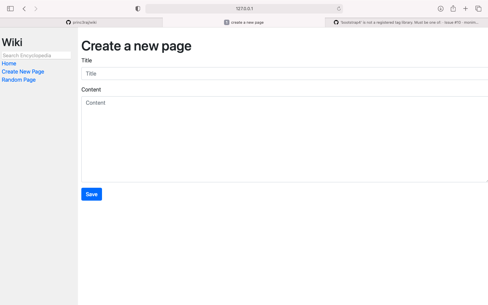

# wiki : A Project based on Wikipedia

###watch the video:- [Click to view](https://youtu.be/pD0dyQyT8fo)

*User can create pages like wikipedia and be able to edit it later on and some extra features like random page and search page via its name are available to users*
## Home page:-

## Page View:-

## search result:-

## edit page:-

## create new page:-

### How to run it on local server:-

* make sure , you have python installed
* clone it and then cd wiki
* activate the virtual environment:- source env/bin/activate
* run:- pip install -r requirements.txt
* migrate: python manage.py migrate
* run the server:- python manage.py runserver

